# 🧱 **1. C4 MODEL — UPDATED MERMAID DIAGRAMS**

---

## **C4 Level 1 — System Context (Updated with all platforms + compliance)**


---

## **C4 Level 2 — Container Diagram (Reflecting 5 Layers + Cross‑Platform)**


---

## **C4 Level 3 — Component Diagram (Backend Core, Fully Updated)**

```mermaid
flowchart TD

    %% API LAYER
    subgraph API_Layer[API Layer]
        R1[query_router.py<br>Query Processing]
        R2[token_validation.py<br>JWT + API Keys]
        R3[error_handler.py<br>Unified Error Responses]
    end

    %% SMART ROUTER
    subgraph SmartRouter[Unified Smart Router Engine]
        SR1[Complexity Analysis<br>TRIVIAL → EXPERT]
        SR2[Device Capability Detection<br>CPU/GPU/Battery/Thermals]
        SR3[Security-Aware Routing<br>Escalation Paths]
    end

    %% VERIFICATION ENGINE
    subgraph Verification[Multi-Layer Verification Engine]
        V1[Schema Validation]
        V2[Plausibility Checks]
        V3[Cross-Reference Validation]
        V4[DARPA Tools<br>Buttercup + SweetBaby]
    end

    %% MODEL LOADER
    subgraph ModelLoader[Progressive Model Loader]
        ML1[Predictive Preloading]
        ML2[Quantization: INT8 / FP16 / BF16]
        ML3[LRU Memory Manager]
        ML4[TensorRT Acceleration]
    end

    API_Layer --> SmartRouter --> Verification --> ModelLoader
```



---

## **C4 Level 4 — Code Diagram (True Execution Path)**

```mermaid
flowchart TD

    A[query_router.py<br>handle_query()] --> B[token_validation.py<br>validate_token()]
    B --> C[Complexity Estimator<br>TF.js (frontend) or backend rules]
    C --> D[unified_smart_router.py<br>route_query()]
    D --> E[multi_layer_verification_engine.py<br>multi-stage validation]
    E --> F[progressive_model_loader.py<br>load_or_quantize_model()]
    F --> G[TensorRT/PyTorch Runtime<br>run_inference()]
    G --> H[Return Response<br>Streaming or Sync]
```

---

# 🟦 **2. LUCIDCHART‑STYLE BLOCK DIAGRAM — UPDATED**


---

# 🔁 **3. SEQUENCE DIAGRAM — UPDATED (Full AMAIMA Pipeline)**


---

Here are all five diagrams in Mermaid form, tuned to the architecture and summaries you shared. You can paste these directly into any Mermaid‑enabled environment.

---

## 1. Mermaid deployment diagram (Docker + Kubernetes + GPU nodes)

```mermaid
flowchart LR

    subgraph UserSpace[User Space]
        U1[Web User]
        U2[Android User]
        U3[API Client]
    end

    subgraph Edge[Edge / Public Entry]
        NGINX[NGINX / Ingress Controller<br>SSL Termination, Routing, Rate Limiting]
    end

    subgraph K8sCluster[Kubernetes Cluster]
        subgraph NSApp[Namespace: amaima]
            subgraph FrontendTier[Frontend Tier]
                FE_DEPLOY[Deployment: amaima-frontend<br>3 replicas]
                FE_SVC[Service: amaima-frontend<br>ClusterIP:80]
            end

            subgraph BackendTier[Backend Tier (GPU)]
                BE_DEPLOY[Deployment: amaima-backend<br>3 replicas<br>1 GPU/pod]
                BE_SVC[Service: amaima-backend<br>ClusterIP:8000]
            end

            subgraph DataTier[Data Tier]
                PG_DEPLOY[Deployment: amaima-postgres]
                PG_PVC[PVC: amaima-postgres-pvc<br>50Gi]
                REDIS_DEPLOY[Deployment: amaima-redis]
                REDIS_PVC[PVC: amaima-redis-pvc<br>5Gi]
            end

            subgraph ObservabilityTier[Observability]
                PROM[Prometheus / Metrics Scrape]
                LOGS[Loki / Log Aggregation]
                TRACE[Jaeger / Tracing]
            end
        end

        subgraph NSMonitoring[Namespace: amaima-monitoring]
            GRAFANA[Grafana Dashboards]
        end
    end

    subgraph NodePool[GPU Node Pool]
        NODE1[K8s Node (GPU)]:::gpu
        NODE2[K8s Node (GPU)]:::gpu
    end

    classDef gpu fill=#f6f2ff,stroke=#6b46c1,stroke-width=1.5px;

    %% Traffic Flow
    U1 --> NGINX
    U2 --> NGINX
    U3 --> NGINX

    NGINX --> FE_SVC
    NGINX --> BE_SVC

    FE_SVC --> FE_DEPLOY
    BE_SVC --> BE_DEPLOY

    BE_DEPLOY --> PG_DEPLOY
    BE_DEPLOY --> REDIS_DEPLOY

    PG_DEPLOY --> PG_PVC
    REDIS_DEPLOY --> REDIS_PVC

    BE_DEPLOY --> PROM
    BE_DEPLOY --> LOGS
    BE_DEPLOY --> TRACE

    PROM --> GRAFANA
    LOGS --> GRAFANA
    TRACE --> GRAFANA

    %% GPU Scheduling
    BE_DEPLOY -. scheduled on .-> NODE1
    BE_DEPLOY -. scheduled on .-> NODE2
```

---

## 2. Mermaid data flow diagram (DFD)

High‑level logical data flow from users through clients, backend, and storage.


---

## 3. Mermaid state machine for the Android app

This focuses on the **overall app lifecycle** from launch, auth, online/offline behavior, query handling, and sync.

```mermaid
stateDiagram-v2
    [*] --> AppLaunching

    state AppLaunching {
        [*] --> InitDI
        InitDI --> LoadConfig
        LoadConfig --> CheckAuthState
        CheckAuthState --> LaunchUnauth : not authenticated
        CheckAuthState --> LaunchDashboard : authenticated
        LaunchUnauth --> [*]
        LaunchDashboard --> [*]
    }

    AppLaunching --> Unauthenticated
    AppLaunching --> Authenticated : existing valid session

    state Unauthenticated {
        [*] --> LoginScreen
        LoginScreen --> Authenticating : user submits credentials
        Authenticating --> Unauthenticated : failure
        Authenticating --> Authenticated : success
    }

    state Authenticated {
        [*] --> Home

        state Home {
            [*] --> Idle
            Idle --> ViewingRecentQueries : user scrolls history
            Idle --> OpeningQueryScreen : new query
            Idle --> OpeningWorkflowScreen : workflows
            Idle --> Settings : open settings
            Settings --> Idle
        }

        Home --> QueryFlow
        Home --> OfflineMode : connectivity lost
        OfflineMode --> Syncing : connectivity restored
        Syncing --> Home

        state QueryFlow {
            [*] --> EditingQuery
            EditingQuery --> EstimatingComplexity : text changed
            EstimatingComplexity --> ReadyToSubmit
            ReadyToSubmit --> SendingOnline : network available
            ReadyToSubmit --> QueuedOffline : offline

            SendingOnline --> WaitingForStream
            WaitingForStream --> ShowingStreamingResult : chunks received
            ShowingStreamingResult --> Completed : final chunk
            Completed --> Home
            Completed --> FeedbackCollected : user rates result
            FeedbackCollected --> Home

            QueuedOffline --> OfflineMode
        }

        Authenticated --> Unauthenticated : logout or token revoked
    }

    Unauthenticated --> [*]
    Authenticated --> [*]
```

---

## 4. Mermaid class diagram for models

I’ll model **TypeScript domain types** from the frontend (queries, workflows, users, WebSocket messages). You can adapt this to Kotlin if you prefer.


If you’d rather see the **Kotlin entity / domain model** version (e.g., `QueryEntity`, `WorkflowEntity`, `UserEntity` with Room annotations), I can mirror this as a Kotlin‑style classDiagram instead.

---

## 5. Mermaid workflow diagram for the 28‑day integration roadmap

I’ll express the 4 phases (7 days each) and the main workstreams per phase. First as a flowchart overview, then as a Gantt if you want timeline visualization.

### 5.1 Flowchart view of phases

```mermaid
flowchart TD

    P1[Phase 1 (Days 1–7)<br>Foundation Integration] --> P2[Phase 2 (Days 8–14)<br>Intelligence Integration]
    P2 --> P3[Phase 3 (Days 15–21)<br>Analysis Integration]
    P3 --> P4[Phase 4 (Days 22–28)<br>Production Hardening]

    subgraph Phase1[Phase 1: Foundation Integration]
        P1A[Integrate Unified Smart Router<br>with complexity analysis]
        P1B[Integrate Progressive Model Loader<br>with TensorRT quantization]
        P1C[Stand up Production API Server<br>REST + WebSocket]
    end

    subgraph Phase2[Phase 2: Intelligence Integration]
        P2A[Integrate Multi-Layer Verification Engine<br>with DARPA tools]
        P2B[Integrate Continuous Learning Engine<br>NeMo RL optimization]
    end

    subgraph Phase3[Phase 3: Analysis Integration]
        P3A[Deploy Benchmark Suite<br>multi-domain evaluation]
        P3B[Implement Cost Analysis Framework]
        P3C[Configure DARPA Readiness Framework<br>NIST 800-53 / FedRAMP]
    end

    subgraph Phase4[Phase 4: Production Hardening]
        P4A[Configure Observability Stack<br>Prometheus + OpenTelemetry]
        P4B[Implement comprehensive error handling<br>and rate limiting]
        P4C[Establish deployment automation<br>Docker, Kubernetes, CI/CD]
    end

    P1 -.includes .-> P1A
    P1 -.includes .-> P1B
    P1 -.includes .-> P1C

    P2 -.includes .-> P2A
    P2 -.includes .-> P2B

    P3 -.includes .-> P3A
    P3 -.includes .-> P3B
    P3 -.includes .-> P3C

    P4 -.includes .-> P4A
    P4 -.includes .-> P4B
    P4 -.includes .-> P4C
```

### 5.2 Gantt‑style timeline (optional, if your renderer supports Mermaid Gantt)


---
