# AMAIMA Enhanced Architectural Diagrams — Comprehensive Technical Reference

## Introduction

This document presents enhanced, production-grade architectural diagrams for the AMAIMA (Advanced Multimodal AI Model Architecture) platform. The diagrams have been refined to provide greater clarity, completeness, and visual organization suitable for stakeholder communication, technical documentation, and system design reviews. Each diagram builds upon the foundation established in the initial diagram set while adding substantive improvements in detail, relationship representation, and architectural fidelity.

The enhanced diagram suite addresses several key improvements over the original set. Visual hierarchy has been refined to clearly distinguish between primary flows, secondary dependencies, and auxiliary concerns. Component granularity has been increased to expose internal module structures that were previously abstracted. Cross-cutting concerns including security, observability, and configuration management receive explicit representation. The deployment diagrams now reflect production-grade patterns including service meshes, multi-region considerations, and comprehensive infrastructure components.

---

## Part One: System Context and Strategic Position

### Enhanced Level 1 System Context Diagram

The System Context diagram provides the highest-level view of AMAIMA's place within the broader organizational and technological landscape. This enhanced version explicitly represents the bidirectional nature of relationships between the platform and its users, the compliance framework that governs operations, and the external services that extend platform capabilities.

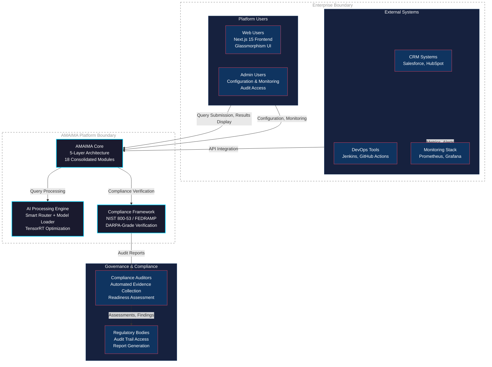

The diagram's visual design employs a color-coding system that persists throughout the diagram suite. Primary platform components appear in dark navy with cyan accents, representing the core AMAIMA technology stack. User-facing and external integration elements appear in a slightly lighter shade with coral accents, distinguishing external touchpoints. Governance and compliance elements use a distinctive accent color that draws attention to the regulatory context. Enterprise and platform boundaries use dashed outlines indicating organizational scope rather than technical boundaries.

The placement of compliance actors at the diagram's periphery reflects their oversight role rather than operational dependency. The bidirectional arrows between auditors and regulators indicate the collaborative nature of compliance verification, where auditors collect evidence that regulators review to assess conformance with applicable standards.

### Strategic Relationship Mapping

Beyond the technical context, understanding AMAIMA's strategic positioning requires mapping relationships with potential partners, acquirers, and technology ecosystem participants. This enhanced diagram represents the strategic landscape while maintaining technical accuracy.

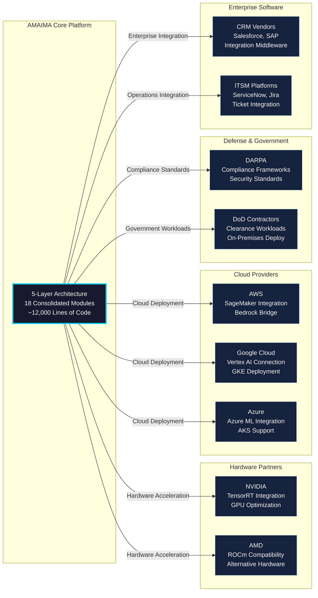

---

## Part Two: Container and Layer Architecture

### Enhanced Container Diagram with Complete Platform Representation

The Container diagram provides a detailed view of the major deployable units within AMAIMA. This enhanced version maintains the five-layer structure while adding explicit representation of data stores, message queues, and the infrastructure services that support platform operations.

```mermaid
flowchart TB
    subgraph Clients["Client Applications"]
        direction LR
        Web["Web Frontend<br/>Next.js 15<br/>React 19<br/>TypeScript<br/>Glassmorphism UI"]
        Android["Android Client<br/>Kotlin<br/>Jetpack Compose<br/>TensorFlow Lite<br/>Offline-First"]
        iOS["iOS Client (Future)<br/>Swift/SwiftUI<br/>Core ML<br/>Native Experience"]
        API["API Clients<br/>REST Consumers<br/>WebSocket Clients<br/>SDK Integrations"]
    end
    
    subgraph Gateway["API Gateway Layer"]
        NGINX["NGINX Ingress<br/>SSL Termination<br/>Rate Limiting<br/>Request Routing<br/>Load Balancing"]
        Auth["Authentication<br/>JWT Validation<br/>API Key Checking<br/>OAuth 2.0"]
        WSS["WebSocket Gateway<br/>Connection Management<br/>Streaming Proxy<br/>Heartbeat Handling"]
    end
    
    subgraph API["API Layer"]
        REST["REST API Server<br/>FastAPI<br/>Pydantic Validation<br/>OpenAPI Docs"]
        WSHandler["WebSocket Handler<br/>Streaming Responses<br/>Real-Time Updates<br/>Query Subscription"]
        Middleware["Middleware Stack<br/>CORS<br/>Compression<br/>Request Logging<br/>Correlation IDs"]
    end
    
    subgraph Foundation["Foundation Layer"]
        SmartRouter["Unified Smart Router Engine<br/>Complexity Analysis (5 Levels)<br/>Device Profiling<br/>Security Routing"]
        ModelLoader["Progressive Model Loader<br/>TensorRT Integration<br/>Quantization (INT8/FP16/BF16)<br/>Predictive Preloading"]
        APICore["Production API Core<br/>Endpoint Implementation<br/>Response Formatting<br/>Error Translation"]
    end
    
    subgraph Integration["Integration Layer"]
        MCP["MCP Orchestration<br/>External Framework<br/>Protocol Adapter<br/>Version Negotiation"]
        PhysicalAI["Physical AI Pipeline<br/>NVIDIA Cosmos<br/>3D Scene Processing<br/>Spatial Reasoning"]
    end
    
    subgraph Intelligence["Intelligence Layer"]
        Verification["Multi-Layer Verification Engine<br/>Schema Validation<br/>Plausibility Checking<br/>DARPA Security Scanning<br/>Consistency Verification"]
        Learning["Continuous Learning Engine<br/>NeMo Toolkit Integration<br/>Feedback Processing<br/>Model Refinement"]
    end
    
    subgraph Analysis["Analysis Layer"]
        Benchmark["Benchmark Suite<br/>Multi-Domain Assessment<br/>Performance Metrics<br/>Accuracy Tracking"]
        Cost["Cost Analyzer<br/>Resource Tracking<br/>Budget Monitoring<br/>Predictive Modeling"]
        Readiness["Readiness Framework<br/>NIST 800-53 Compliance<br/>FEDRAMP Assessment<br/>Automated Evidence"]
    end
    
    subgraph Infrastructure["Infrastructure Layer"]
        Observability["Observability Stack<br/>Prometheus Metrics<br/>OpenTelemetry Tracing<br/>Grafana Dashboards"]
        Config["Config Manager<br/>Environment Configuration<br/>Feature Flags<br/>Dynamic Updates"]
        Deploy["Deployment Utilities<br/>Docker/Kubernetes<br/>CI/CD Pipeline<br/>Blue-Green Deployment"]
    end
    
    subgraph Storage["Data & Caching Layer"]
        PostgreSQL[(PostgreSQL<br/>Queries, Workflows<br/>User Data, Audit Logs)]
        Redis[(Redis Cluster<br/>Session Storage<br/>Routing Cache<br/>Rate Limiting)]
        S3[(Object Storage<br/>File Uploads<br/>Model Artifacts<br/>Backup Archives)]
        Files[(Local Filesystem<br/>Configuration<br/>Logs<br/>Temporary Data)]
    end
    
    Clients --> Gateway
    Gateway --> API
    API --> Foundation
    Foundation --> Integration
    Integration --> Intelligence
    Intelligence --> Analysis
    Analysis --> Infrastructure
    
    API --> Storage
    Foundation --> Storage
    Infrastructure --> Storage
    
    classDef client fill:#1a1a2e,stroke:#00d4ff,stroke-width:2px,color:#fff
    classDef layer fill:#16213e,stroke:#0f3460,stroke-width:1px,color:#fff
    classDef storage fill:#0f3460,stroke:#e94560,stroke-width:1px,color:#fff
    classDef gateway fill:#1f4068,stroke:#00d4ff,stroke-width:1px,color:#fff
    
    class Web,Android,iOS,API client
    class Foundation,Integration,Intelligence,Analysis,Infrastructure layer
    class PostgreSQL,Redis,S3,Files storage
    class NGINX,Auth,WSS gateway
```

This enhanced container diagram provides several improvements over the original. The Gateway layer now includes explicit representation of authentication and WebSocket handling, recognizing these as distinct concerns that warrant architectural attention. The Storage layer has been elevated from implicit representation to explicit placement, acknowledging that persistent storage is a first-class architectural concern. The bidirectional connections between API and Storage reflect that all platform layers interact with persistence, not just the API layer.

### Layer Interaction Detail Diagram

To complement the container overview, this diagram provides detailed interaction patterns between layers, showing how requests flow through the system and how responses propagate back to clients.

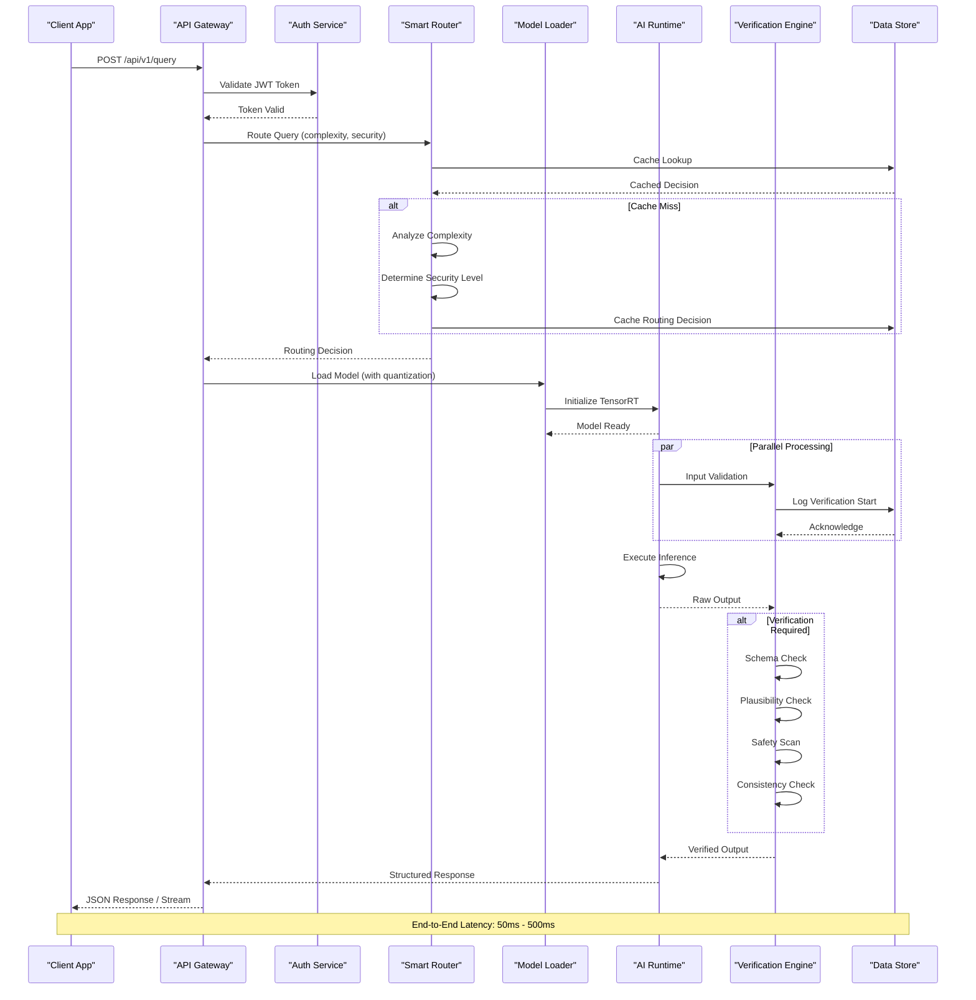

---

## Part Three: Component-Level Architecture

### Enhanced Backend Component Diagram

The Component diagram provides detailed views of the internal structure of major containers. This enhanced backend component diagram exposes the internal module structure of each crown-jewel component while maintaining appropriate abstraction boundaries.

```mermaid
flowchart TB
    subgraph API["API Server Components"]
        direction TB
        Endpoints["REST Endpoints<br/>Query, Workflow, User, Model, System"]
        Validation["Request Validation<br/>Pydantic Models<br/>Schema Enforcement"]
        Serialization["Response Serialization<br/>JSON Encoding<br/>Streaming Support"]
        Errors["Error Handling<br/>Exception Mapping<br/>User-Friendly Messages"]
    end
    
    subgraph Router["Smart Router Engine"]
        direction TB
        Complexity["Complexity Analyzer<br/>NLP-based Classification<br/>5-Level Taxonomy"]
        Device["Device Profiler<br/>CPU/GPU Detection<br/>Memory Assessment<br/>Battery/Thermal"]
        Security["Security Classifier<br/>Sensitive Operation Detection<br/>Escalation Routing"]
        Decision["Decision Engine<br/>Multi-Factor Weighting<br/>Cost Optimization"]
    end
    
    subgraph Loader["Progressive Model Loader"]
        direction TB
        Registry["Model Registry<br/>Version Management<br/>Metadata Storage"]
        Quantize["Quantization Pipeline<br/>INT8/FP16/BF16<br/>Accuracy Validation"]
        Memory["Memory Manager<br/>LRU Eviction<br/>Allocation Tracking"]
        Predict["Predictive Loader<br/>Usage Pattern Analysis<br/>Preload Scheduling"]
    end
    
    subgraph Verify["Verification Engine"]
        direction TB
        Syntax["Syntax Validator<br/>Schema Compliance<br/>Type Checking"]
        Semantic["Semantic Validator<br/>Question-Answer Coherence<br/>Knowledge Cross-Reference"]
        Safety["Safety Scanner<br/>Content Policy<br/>Vulnerability Detection"]
        DARPA["DARPA Integration<br/>Buttercup Scanner<br/>SweetBaby Patcher"]
    end
    
    subgraph Observe["Observability Framework"]
        direction TB
        Metrics["Metrics Collector<br/>Prometheus Exposition<br/>Custom Metrics"]
        Tracing["Distributed Tracing<br/>Span Management<br/>Correlation IDs"]
        Logging["Structured Logging<br/>Log Aggregation<br/>Context Enrichment"]
        Alerting["Alert Manager<br/>Threshold Evaluation<br/>Notification Routing"]
    end
    
    subgraph Data["Data Layer"]
        direction TB
        Repositories["Repository Pattern<br/>Query, User, Workflow Repositories"]
        Mappers["Data Mappers<br/>Entity to Domain<br/>Domain to DTO"]
        Transactions["Transaction Management<br/>Unit of Work<br/>Rollback Support"]
    end
    
    API --> Router
    API --> Data
    Router --> Loader
    Router --> Verify
    Loader --> Data
    Verify --> Data
    Observe --> Data
    
    classDef api fill:#1a1a2e,stroke:#00d4ff,stroke-width:2px,color:#fff
    classDef component fill:#16213e,stroke:#0f3460,stroke-width:1px,color:#fff
    classDef data fill:#0f3460,stroke:#e94560,stroke-width:1px,color:#fff
    
    class API,Router,Loader,Verify,Observe component
    class Endpoints,Complexity,Registry,Syntax,Metrics,Repositories data
```

### Frontend Component Architecture

The frontend component diagram reveals the internal structure of the Next.js application, showing how UI components, state management, and API integration interact to deliver the user experience.

```mermaid
flowchart TB
    subgraph App["Next.js Application"]
        direction TB
        Pages["Page Components<br/>App Router Layouts<br/>Route Groups"]
        Layouts["Layout Wrappers<br/>Dashboard Layout<br/>Auth Layout"]
        Middleware["Next.js Middleware<br/>Auth Guard<br/>Route Protection"]
    end
    
    subgraph UI["UI Component Library"]
        direction TB
        Base["Base Components<br/>Button, Card, Input<br/>Textarea, Badge"]
        Glass["Glassmorphism Components<br/>Backdrop Blur<br/>Gradient Backgrounds"]
        Charts["Data Visualization<br/>Recharts Integration<br/>Sparklines, Area Charts"]
        Code["Code Display<br/>Syntax Highlighting<br/>Copy Functionality"]
    end
    
    subgraph Features["Feature Components"]
        direction TB
        Query["Query Components<br/>QueryInput, StreamingResponse<br/>Complexity Indicator"]
        Workflow["Workflow Components<br/>Builder, Steps, Execution"]
        Dashboard["Dashboard Components<br/>SystemMonitor, MetricsDisplay"]
        Auth["Auth Components<br/>Login, Register, Profile"]
    end
    
    subgraph State["State Management"]
        direction TB
        AuthStore["Auth Store<br/>Zustand + CryptoJS<br/>JWT Persistence"]
        QueryStore["Query Store<br/>Active/HISTORICAL Queries<br/>Streaming Updates"]
        SystemStore["System Store<br/>Real-Time Metrics<br/>Model Status"]
        ConfigStore["Config Store<br/>User Preferences<br/>Feature Flags"]
    end
    
    subgraph Integration["Integration Layer"]
        direction TB
        APIClient["API Client<br/>Typed Fetch Wrapper<br/>Auth Injection"]
        WebSocket["WebSocket Provider<br/>Auto-Reconnect<br/>Message Queue"]
        ML["ML Integration<br/>TensorFlow.js<br/>Complexity Estimation"]
        Storage["Secure Storage<br/>AES Encryption<br/>LocalStorage Wrapper"]
    end
    
    App --> UI
    App --> Features
    App --> State
    App --> Integration
    
    Features --> State
    UI --> State
    Integration --> State
    
    classDef app fill:#1a1a2e,stroke:#00d4ff,stroke-width:2px,color:#fff
    classDef layer fill:#16213e,stroke:#0f3460,stroke-width:1px,color:#fff
    classDef integration fill:#0f3460,stroke:#e94560,stroke-width:1px,color:#fff
    
    class App layer
    class UI,Features,State integration
    class Pages,Base,Query,AuthStore,APIClient integration
```

---

## Part Four: Android Client Architecture

### Complete Android Application Architecture

This comprehensive diagram represents the full Android application architecture following Clean Architecture principles, showing the complete package structure and component relationships.

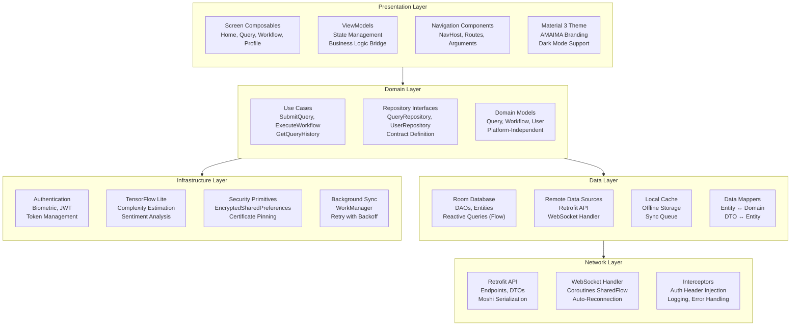

### Android State Machine with Complete Lifecycle

This enhanced state machine provides comprehensive coverage of the Android application lifecycle, including offline/online transitions, background/foreground states, and error recovery patterns.

```mermaid
stateDiagram-v2
    [*] --> Launching : Cold Start
    
    state Launching {
        [*] --> DI_Init
        DI_Init --> Config_Load
        Config_Load --> Auth_State_Check
        Auth_State_Check --> Splash_Complete : success
        Auth_State_Check --> Auth_Required : no valid session
    }
    
    Launching --> Unauthenticated : not authenticated
    Launching --> Authenticated : valid session exists
    
    state Unauthenticated {
        [*] --> Login_Screen
        Login_Screen --> Credential_Entry : user interaction
        Credential_Entry --> Authenticating : submit
        Authenticating --> Login_Failed : error
        Login_Failed --> Credential_Entry : retry
        Authenticating --> Authenticated : success
    }
    
    state Authenticated {
        [*] --> Home_Dashboard
        
        state Home_Dashboard {
            [*] --> Idle
            Idle --> Recent_Queries : view history
            Idle --> New_Query : create query
            Idle --> Workflow_List : manage workflows
            Idle --> Settings : configure app
            Settings --> Idle
            Recent_Queries --> Idle
            New_Query --> Idle
            Workflow_List --> Idle
        }
        
        Home_Dashboard --> Background : app minimized
        Background --> Foreground : app restored
        Background --> Network_Lost : connectivity change
        Background --> Network_Restored : connectivity change
        
        state New_Query {
            [*] --> Text_Entry
            Text_Entry --> Complexity_Estimate : text change
            Complexity_Estimate --> Ready_To_Submit : estimate complete
            Ready_To_Submit --> Submit_Online : network available
            Ready_To_Submit --> Queue_Offline : network unavailable
            
            Submit_Online --> Streaming_Response : stream starts
            Streaming_Response --> Response_Complete : final chunk
            Response_Complete --> Feedback_Prompt : user rating
            Feedback_Prompt --> Home_Dashboard : submitted
            
            Queue_Offline --> Sync_Pending : stored locally
        }
        
        state Network_Lost {
            [*] --> Offline_Mode
            Offline_Mode --> Pending_Sync : connection returns
            Offline_Mode --> Background : app minimized
        }
        
        state Network_Restored {
            [*] --> Sync_Pending_Operations
            Sync_Pending_Operations --> Sync_In_Progress : processing
            Sync_In_Progress --> Sync_Complete : all synced
            Sync_In_Progress --> Sync_Failed : error, will retry
            Sync_Complete --> Home_Dashboard
        }
        
        Authenticated --> Unauthenticated : logout
        Authenticated --> Session_Expired : token invalid
    }
    
    state Session_Expired {
        [*] --> Token_Refresh
        Token_Refresh --> Refresh_Success : valid refresh token
        Token_Refresh --> Auth_Required : refresh failed
        Refresh_Success --> Authenticated
    }
    
    state Background_Services {
        [*] --> Model_Download
        Model_Download --> Download_Complete : finished
        Model_Download --> Download_Failed : error, retry scheduled
        Download_Complete --> Idle
        Download_Failed --> Idle
    }
    
    state Error_Recovery {
        [*] --> Error_Display
        Error_Display --> Retry_Action : user initiates
        Error_Display --> Home_Dashboard : dismiss
        Retry_Action --> Original_Action
    }
    
    Unauthenticated --> [*] : app uninstall
    Authenticated --> [*] : app uninstall
    
    classDef normal fill:#1a1a2e,stroke:#00d4ff,stroke-width:1px,color:#fff
    classDef state fill:#16213e,stroke:#0f3460,stroke-width:1px,color:#fff
    classDef action fill:#0f3460,stroke:#e94560,stroke-width:1px,color:#fff
    
    class Launching,Authenticated,Unauthenticated state
    class Login_Screen,Home_Dashboard,New_Query,Network_Lost action
    class Text_Entry,Streaming_Response,Offline_Mode normal
```

---

## Part Five: Data Flow and Information Architecture

### Comprehensive Data Flow Diagram

This enhanced DFD provides complete coverage of data flows within AMAIMA, including data transformations, storage interactions, and external system integrations.

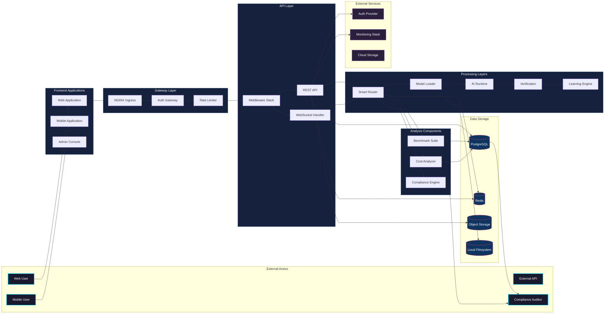

### Domain Model Class Diagram

This comprehensive class diagram represents the complete domain model spanning all platform layers, with proper relationships and multiplicity indicators.

```mermaid
classDiagram
    %% User and Authentication
    class User {
        +String id
        +String email
        +String displayName
        +UserRole role
        +Boolean isActive
        +Date createdAt
        +Date lastLoginAt
        +updatePreferences()
        +updateProfile()
    }
    
    class UserRole {
        <<enumeration>>
        USER
        ADMIN
        PREMIUM
    }
    
    class UserPreferences {
        +String theme
        +String language
        +Boolean telemetryOptIn
        +NotificationSettings notifications
    }
    
    class NotificationSettings {
        +Boolean email
        +Boolean push
        +Boolean queryComplete
        +Boolean systemAlerts
    }
    
    %% Query Domain
    class Query {
        +String id
        +String userId
        +String text
        +QueryOperationType operationType
        +QueryStatus status
        +QueryComplexity complexity
        +String modelUsed
        +Integer tokenCount
        +Integer latencyMs
        +Float confidenceScore
        +String response
        +Date createdAt
        +Date completedAt
        +submit()
        +cancel()
    }
    
    class QueryOperationType {
        <<enumeration>>
        GENERAL
        CODE_GENERATION
        ANALYSIS
        TRANSLATION
        CREATIVE
        QUESTION_ANSWERING
    }
    
    class QueryStatus {
        <<enumeration>>
        PENDING
        QUEUED
        PROCESSING
        STREAMING
        COMPLETED
        FAILED
        CANCELLED
    }
    
    class QueryComplexity {
        <<enumeration>>
        TRIVIAL
        SIMPLE
        MODERATE
        COMPLEX
        EXPERT
    }
    
    %% Workflow Domain
    class Workflow {
        +String id
        +String userId
        +String name
        +String description
        +WorkflowStatus status
        +List~WorkflowStep~ steps
        +Integer executionCount
        +Date createdAt
        +Date lastExecutedAt
        +execute()
        +pause()
        +resume()
    }
    
    class WorkflowStep {
        +String id
        +String workflowId
        +WorkflowStepType type
        +Integer orderIndex
        +Map~string, any~ parameters
        +List~string~ dependsOn
        +WorkflowStepStatus status
        +String result
        +execute()
    }
    
    class WorkflowStepType {
        <<enumeration>>
        QUERY
        CONDITION
        LOOP
        FUNCTION
        API_CALL
        TRANSFORM
        PARALLEL
    }
    
    class WorkflowStatus {
        <<enumeration>>
        DRAFT
        READY
        RUNNING
        PAUSED
        COMPLETED
        FAILED
        CANCELLED
    }
    
    %% Model Domain
    class Model {
        +String id
        +String name
        +ModelType type
        +String version
        +ModelStatus status
        +Integer parameters
        +String quantization
        +String path
        +Date loadedAt
        +load()
        +unload()
    }
    
    class ModelType {
        <<enumeration>>
        LANGUAGE
        CODE
        EMBEDDING
        RERANKER
        MULTIMODAL
    }
    
    class ModelStatus {
        <<enumeration>>
        AVAILABLE
        LOADING
        LOADED
        UNLOADING
        ERROR
    }
    
    %% Verification Domain
    class VerificationResult {
        +String queryId
        +VerificationLevel level
        +Boolean passed
        +List~string~ issues
        +Float score
        +Date timestamp
    }
    
    class VerificationLevel {
        <<enumeration>>
        SYNTAX
        SEMANTIC
        SAFETY
        CONSISTENCY
    }
    
    %% Compliance Domain
    class ComplianceReport {
        +String id
        +String standard
        +ComplianceStatus status
        +Map~string, ComplianceMetric~ metrics
        +Date generatedAt
        +String evidencePath
    }
    
    class ComplianceStatus {
        <<enumeration>>
        COMPLIANT
        NON_COMPLIANT
        PARTIAL
        NOT_ASSESSED
    }
    
    class ComplianceMetric {
        +String name
        +Boolean passed
        +String description
        +List~string~ evidence
    }
    
    %% Relationships
    User "1" --> "1" UserPreferences : has
    User "1" --> "*" Query : submits
    User "1" --> "*" Workflow : creates
    User "1" --> "*" ComplianceReport : generates
    
    Query --> QueryOperationType : typed by
    Query --> QueryStatus : has
    Query --> QueryComplexity : classified as
    Query --> "*" VerificationResult : verified by
    
    Workflow "1" --> "*" WorkflowStep : contains
    WorkflowStep --> WorkflowStepType : typed as
    WorkflowStep --> WorkflowStepStatus : has
    
    Model --> ModelType : categorized as
    Model --> ModelStatus : has state
    
    %% Metrics and Analysis
    class UsageMetrics {
        +String id
        +String userId
        +Date timestamp
        +Integer queryCount
        +Integer tokenCount
        +Float cost
        +Duration avgLatency
    }
    
    class CostSnapshot {
        +String id
        +Date periodStart
        +Date periodEnd
        +Float computeCost
        +Float storageCost
        +Float apiCost
        +Float totalCost
        +BudgetStatus status
    }
    
    class BudgetStatus {
        <<enumeration>>
        WITHIN_BUDGET
        NEAR_LIMIT
        OVER_BUDGET
    }
    
    User "1" --> "*" UsageMetrics : generates
    User "1" --> "*" CostSnapshot : tracks
    
    classDef entity fill:#1a1a2e,stroke:#00d4ff,stroke-width:1px,color:#fff
    classDef enum fill:#16213e,stroke:#0f3460,stroke-width:1px,color:#fff
    
    class User,Query,Workflow,Model,VerificationResult,ComplianceReport,UsageMetrics,CostSnapshot entity
    class UserRole,QueryOperationType,QueryStatus,QueryComplexity,WorkflowStepType,WorkflowStatus,ModelType,ModelStatus,VerificationLevel,ComplianceStatus,BudgetStatus enum
```

---

## Part Six: Deployment Architecture

### Production Kubernetes Deployment Diagram

This enhanced deployment diagram provides a complete view of a production-grade Kubernetes deployment, including infrastructure components, security configurations, and multi-region considerations.

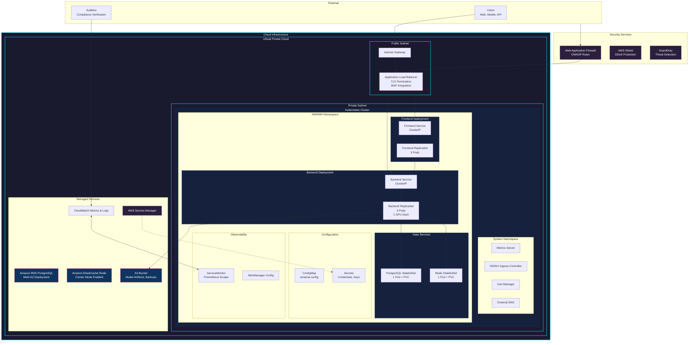

### Docker Compose Topology Diagram

This diagram provides a clear view of the local development and testing deployment topology using Docker Compose.

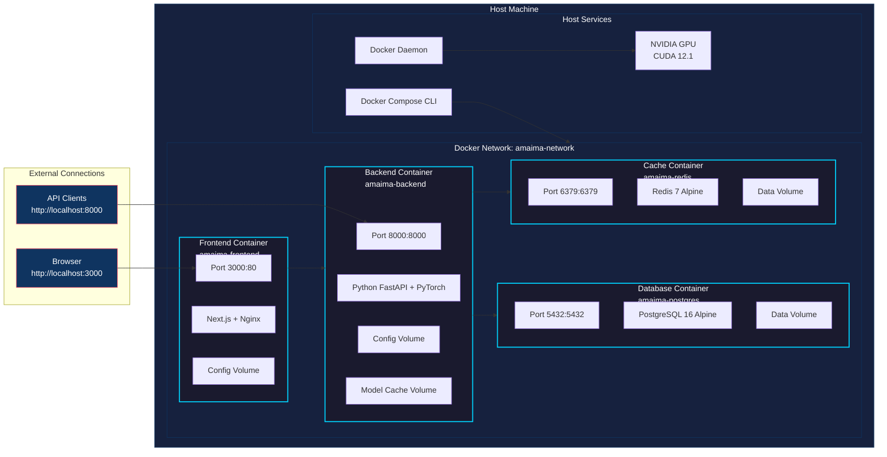

---

## Part Seven: Integration and Communication Patterns

### WebSocket Communication Flow

This detailed sequence diagram captures the complete WebSocket communication pattern used for real-time query streaming and system updates.

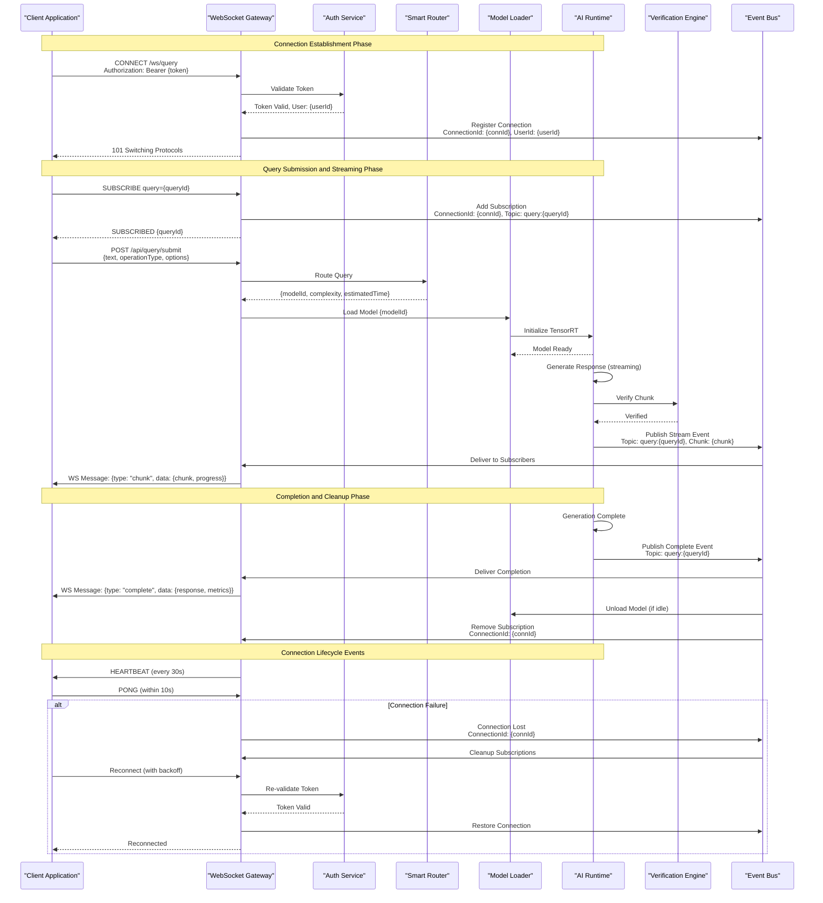

### API Endpoint Mapping

This diagram provides a comprehensive mapping of API endpoints organized by functional domain, showing the complete REST API surface area.

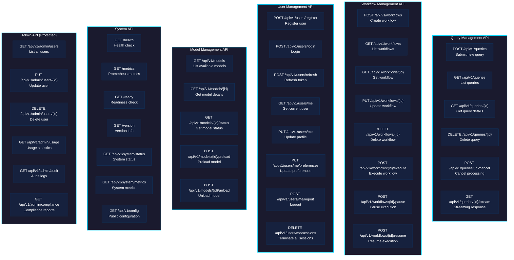

---

## Part Eight: Implementation Roadmap

### 28-Day Integration Timeline

This enhanced Gantt chart provides a detailed view of the 28-day integration roadmap, showing dependencies, milestones, and parallel workstreams.

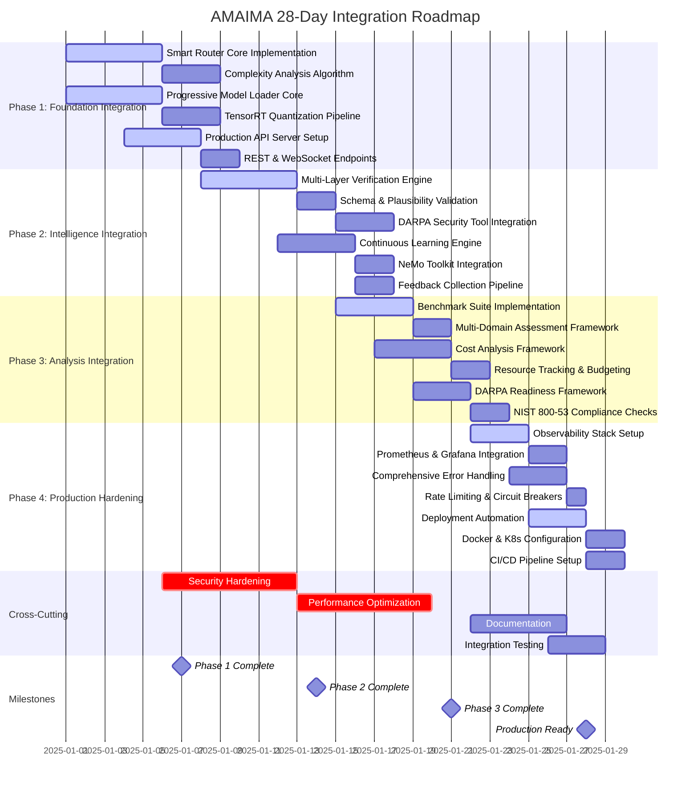

### Dependency Graph

This diagram shows the critical dependency relationships between workstreams, helping identify potential bottlenecks and parallelization opportunities.

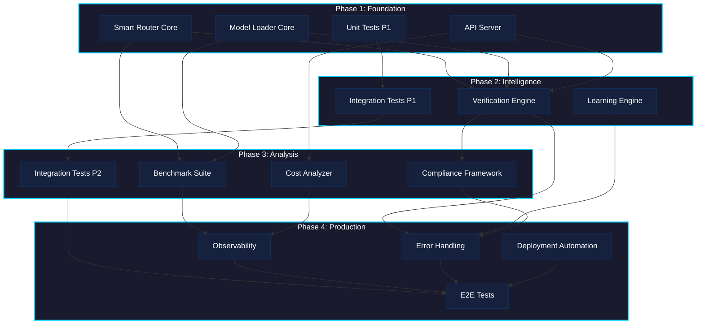

---

## Conclusion

The enhanced AMAIMA architectural diagrams presented in this document provide comprehensive visual documentation suitable for technical design reviews, stakeholder communication, and implementation guidance. The diagrams build upon the foundation established in the initial diagram set while adding significant improvements in visual hierarchy, component granularity, and architectural completeness.

The C4 model diagrams provide progressively detailed views of the system, from strategic context through implementation details. The container and component diagrams expose the internal structure of major platform elements while maintaining appropriate abstraction boundaries. The deployment diagrams capture production-grade infrastructure patterns suitable for enterprise operations. The sequence and data flow diagrams document the dynamic behavior of the platform, showing how components interact to deliver functionality.

These diagrams serve multiple purposes across the software development lifecycle. During design reviews, they provide a common vocabulary for discussing architectural decisions. During implementation, they guide developers in understanding component relationships and interfaces. During operations, they support troubleshooting by mapping symptoms to likely root causes. During evolution, they help assess the impact of proposed changes on system behavior.

The visual design conventions established in this document should be maintained in any future diagram additions or modifications, ensuring consistency across the documentation suite. Color coding, shape conventions, and relationship notation should follow the patterns established here, enabling readers to quickly interpret new diagrams using the mental models developed from these foundational representations.
